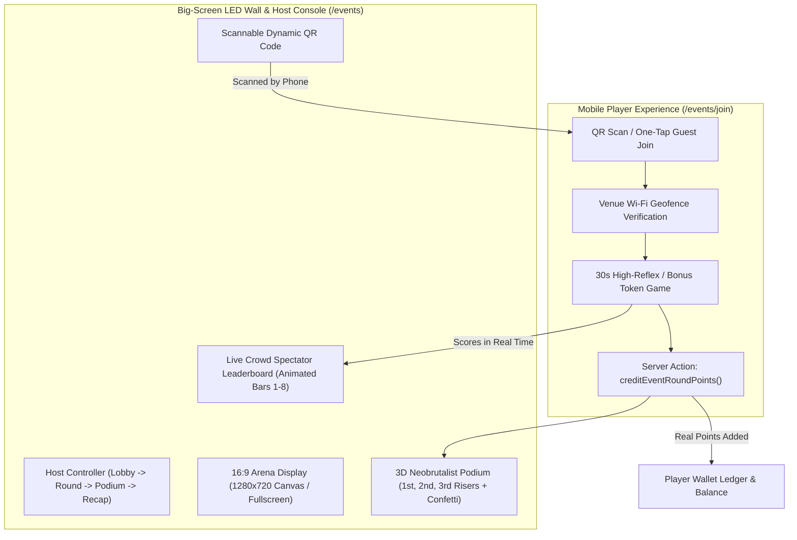
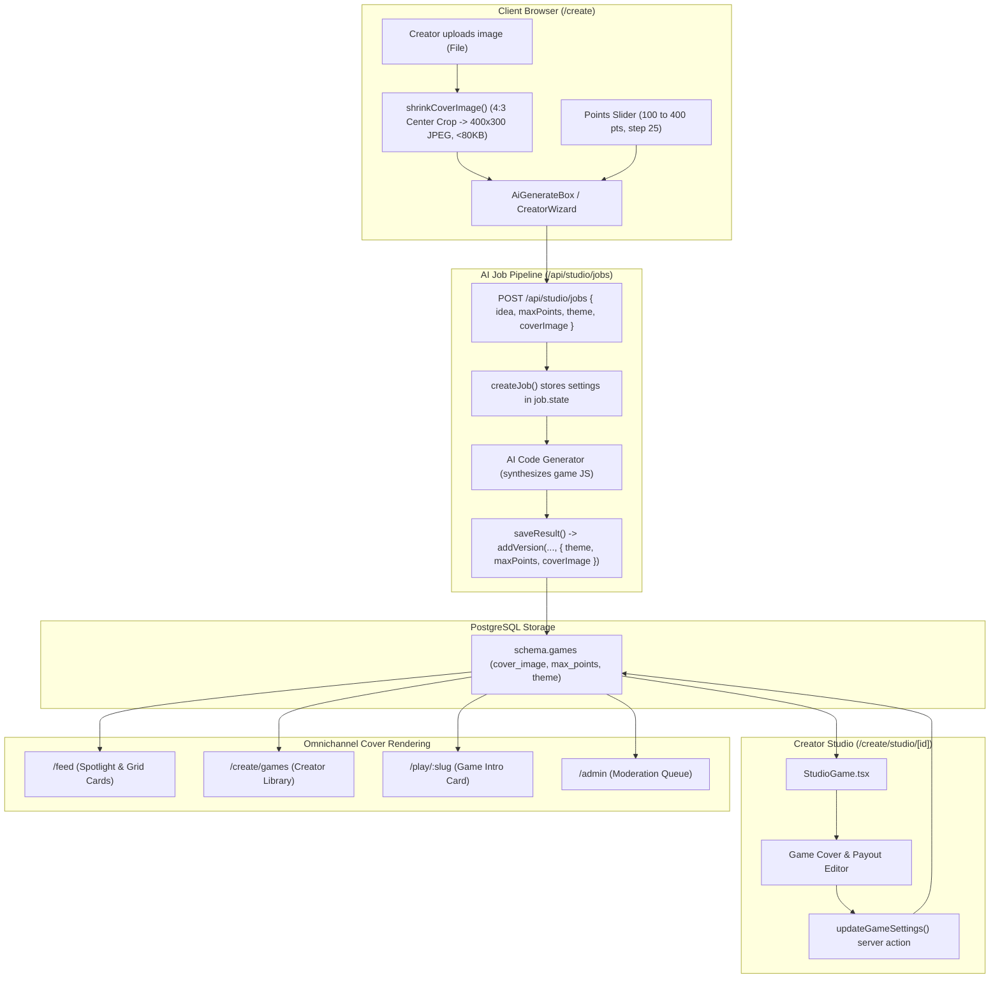
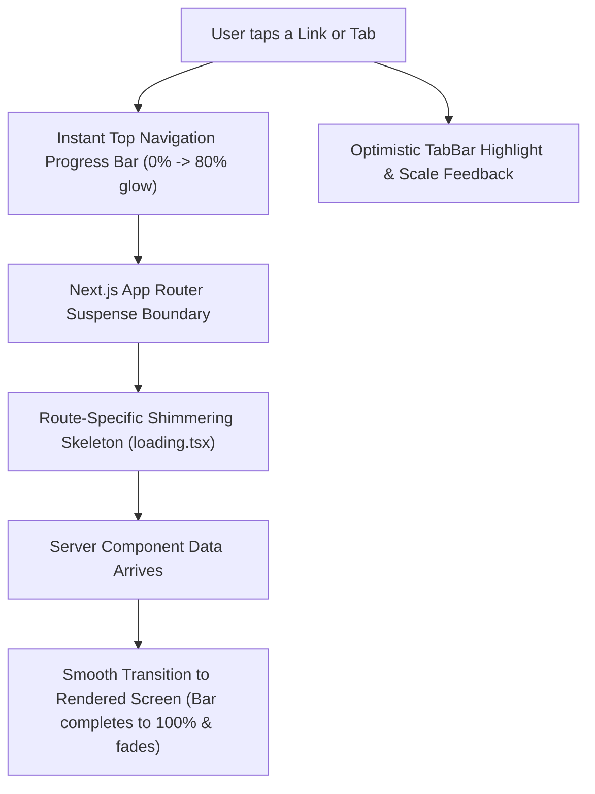

# PlayLoop — Master Feature Walkthrough & Verification Guide

Comprehensive guide to all 8 completed development phases of the **PlayLoop** omnichannel gamification and brand engagement platform.

---

## Roadmap & Milestone Overview

| Phase | Feature Name | Core Deliverables | Status |
| :--- | :--- | :--- | :--- |
| **Phase 1** | **Quick Wins** | Daily streak tracker, animated TopBar HUD, rotating 30s HMAC QR vouchers, 2,000 pt daily guest cap | ✅ Production |
| **Phase 2** | **Social Layer** | Symmetric `friendships` table, friend avatar picker, one-tap Web Share API, weekly friends leaderboard | ✅ Production |
| **Phase 3** | **Player Experience & Identity** | Avatar & profile editor on `/wallet`, 8-tier Perks Roadmap modal, level-up celebration, sponsored hero | ✅ Production |
| **Phase 4** | **Brand Console & Sponsor Analytics** | 5-stage conversion funnel, 7.2x Felt Value ROI, per-store footfall matrix, dynamic campaign forecast calculator | ✅ Production |
| **Phase 5** | **Universal Guest Mode** | 1-click frictionless guest play from `/login`, welcome grant, and atomic OnePass account claim & merge | ✅ Production |
| **Phase 6** | **Leagues & Community Competitions** | `leagues` & `league_members` tables, 4 categories (Schools, Companies, Malls, Families), 5 national seasons, 5-tier Season Pass | ✅ Production |
| **Phase 7** | **Big-Screen LED Event & Venue Mode** | 16:9 responsive arena wall (`/events`), 5-state machine, live spectator leaderboard, 3D podium with confetti, mobile companion | ✅ Production |
| **Phase 8** | **Live Arena Polish & Custom Venue Creator** | PostgreSQL `venue_events` persistence, `/brand` activation builder, Web Audio API sound effects synthesizer | ✅ Production |
| **Phase 9** | **AI Create Custom Cover & Points Parity** | Client-side 4:3 canvas crop, `games.cover_image` storage, max points slider (100–400 pts), AI & Wizard creation parity, Studio settings editor, Feed/Intro/Admin rendering | ✅ Production |
| **Phase 10** | **Omnichannel Shimmering Skeletons & Zero-Freeze Navigation** | Shimmering neobrutalist skeletons across all 11 routes, instant top navigation progress bar, optimistic TabBar active feedback, in-flight AI generation status cards | ✅ Production |

---

# Detailed Walkthroughs

---

## Phase 7: Big-Screen LED Event & Venue Mode

Phase 7 brings the **Big-Screen LED Event & Venue Mode** from `playloop_8.html` into the production Next.js monorepo. This activation mode connects physical retail footfall with digital gameplay in shopping malls, exhibitions, and gaming arenas.

### 1. Architecture & Core Modules



### 2. Implemented Features

#### A. Event Configuration & Payout Engine
- **`apps/web/lib/events.ts`**:
  - **Venue Presets**:
    - `OASIS-LIVE`: *Oasis Mall National Day Live* (Presented by Beanhouse Specialty Coffee, Central Atrium LED Wall).
    - `DUBAI-LIVE`: *Dubai Mall Ice Rink Showdown* (Presented by Level Shoes).
    - `GLOW-LIVE`: *Glow Arcade Championship* (Presented by VOX Cinemas).
  - **Simulated Crowd Generator** (`generateSimulatedPlayer`):
    - Realistic UAE demographic name pool (Aisha, Omar, Priya, Jun, Layla, Khalid, Fatima, etc.).
    - Dynamic avatar assignments (0–5), natural skill distribution, and real-time score accumulation.
  - **Podium Payouts** (`calculateRoundPayout`):
    - Base gameplay payout from `@playloop/economy` + live podium bonuses (`EVENT_PODIUM_BONUS = [100, 60, 30]`).

#### B. Master Big-Screen LED Wall & Host Console
- **Route**: **[`/events`](http://localhost:3000/events)**
- **Component**: `EventArenaClient.tsx`
- **16:9 Display & Fullscreen API**:
  - Scales automatically to standard desktop, mobile preview, or 4K/LED wall displays (`100vw`, `100vh`) with keyboard shortcut `F`.
- **5-State Arena Machine**:
  1. **`idle`**: Neon arena standby branding, glowing PlayLoop LIVE badge, sponsor subtitle (*"Presented by Beanhouse"*), venue details.
  2. **`lobby`**: Scannable high-contrast QR code box (generated vector SVG), join code (`OASIS-LIVE`), giant crowd player counter, animated avatar mosaic, and real-time join ticker.
  3. **`round`**: Dramatic animated 3-2-1-GO! countdown overlay, circular SVG countdown timer (30s) with animated stroke offset, live animated spectator leaderboard bars (ranks 1–8 with moving progress bars and highlight for host/player), aggregate crowd score counter, and latecomer mini QR.
  4. **`results` (3D Podium Celebration)**: 3D Neobrutalist Podium with staggered rising risers:
     - 🥇 **1st Place Gold Riser** (Center, 220px, `#FFDD3C`, Trophy crown, avatar, name, score)
     - 🥈 **2nd Place Silver Riser** (Left, 160px, `#3FC8FF`, avatar, name, score)
     - 🥉 **3rd Place Bronze Riser** (Right, 120px, `#FF7A1A`, avatar, name, score)
     - Multi-colored confetti particle shower!
  5. **`recap`**: 6 comprehensive activation KPI cards (Players joined, OnePass IDs linked, Total points funded by sponsor pool, Branded play minutes, 7-day return target, App retention seed).
- **Host Controller Dock**:
  - Stage advance buttons (`Open Lobby`, `Start Round`, `Force Finish`, `Podium`, `Wrap-Up`, `Reset`).
  - Crowd Simulator controls (`+5 Joins`, `+20 Joins`, `Auto-Join: ON/OFF`).
  - Shortcut keys: `Space` (advance state), `F` (fullscreen toggle).
- **Live Companion Phone Preview**:
  - Embedded toggleable smartphone simulator running side-by-side with the LED screen for live demonstrations.

#### C. Mobile Player Join Experience
- **Route**: **[`/events/join?code=OASIS-LIVE`](http://localhost:3000/events/join?code=OASIS-LIVE)**
- **Component**: `EventMobileClient.tsx`
- **Frictionless Entry**:
  - Links existing OnePass profile or mints an instant guest profile with formatted OnePass ID (e.g. `OP-8492-NV`).
  - Verified Venue Badge: *"✓ Venue check verified: Inside Oasis Mall Arena geofence on mall Wi-Fi"*.
- **Live 30-Second Mini-Game**:
  - Fast-action token catching: Players tap appearing coffee beans / stars / sponsor tokens.
  - Streak and combo multipliers (`2x`, `3x COMBO!`) with floating score notifications.
  - Automated round completion, final rank calculation, and instant wallet crediting via `creditEventRoundPoints` server action!
- **Post-Round Ceremony**:
  - Shows rank (`#4 of 48 players`), points won (`+260 points saved to OnePass`), and direct links to `/feed` and `/wallet`.

---

## Phase 8: Live Arena Polish & Custom Venue Creator

Phase 8 elevates the live arena system from hardcoded presets into a fully dynamic, self-serve venue creation and operation tool within the **Brand Console** (`/brand`).

### 1. Implemented Features

#### A. Database Schema & Migration (`packages/db`)
- **`venue_events` Table**:
  - `id`: UUID primary key.
  - `brand_id`: References `brands.id`.
  - `code`: Unique activation join code (e.g. `HILLS-LIVE`, `OASIS-LIVE`).
  - `title`: Event title (e.g. *"Dubai Hills Mall Grand Weekend"*).
  - `arabicTitle`: Optional localized title.
  - `venue_name`: Venue name (e.g. *"Dubai Hills Mall Arena"*).
  - `location`: Specific screen position (e.g. *"Central Atrium LED Wall, Ground Level"*).
  - `sponsor_name`: Brand sponsor name.
  - `sponsor_tagline`: Sponsor presentation text.
  - `accent_color`: LED wall theme accent color (`#FFDD3C`, `#3FC8FF`, `#FF5FA2`, `#22D39B`, `#A78BFA`).
  - `prize_pool_points`: Integer points budget.
  - `status`: Activation state (`live`, `draft`, `scheduled`, `completed`).
  - `rounds`: JSONB array of `EventRound` definitions (number, title, game type, duration, target score, max points).
  - `creator_id`: References `profiles.id`.
  - `created_at`: Timestamp with timezone.
- **DDL Migration & Seeding**:
  - Raw SQL table creation and indexing in `packages/db/src/seed.ts`.
  - Seeded standard default activations (`OASIS-LIVE`, `DUBAI-LIVE`, `GLOW-LIVE`).

#### B. Brand Console UI & Creator Modal (`apps/web/app/brand`)
- **"Live Arena Activations" Section**:
  - Positioned prominently in `/brand` for brand managers.
  - Displays all active brand-owned arena activations with custom accent color left borders.
  - Shows join code badge, venue name, screen location, prize pool budget, and round sequence.
  - Quick action buttons:
    - `▶ Launch LED Screen` (opens `/events?code=...` in new tab).
    - `📱 Mobile Join` (opens `/events/join?code=...`).
    - `📋 Copy Link` (one-click copy with temporary feedback).
- **`CreateArenaModal.tsx`**:
  - Join Code Generator: Automatic random code generator (e.g. `ARENA-492`, `FEST-821`) or custom input.
  - Title, Venue Name, Screen Location, and optional Arabic title.
  - 5-Palette LED Accent Color picker (Lemon, Cyan, Neon Pink, Mint, Violet).
  - Prize Pool budget allocator (500 to 1,000,000 points).
  - Flexible Round Designer:
    - Round 1 (Qualifying): Game type (`tap`, `reflex`, `catch`), duration (20s–45s), target score, max points.
    - Optional Round 2 (Championship Finals): Toggleable second round with custom duration and max points.
  - Server action `createVenueEvent` validating uniqueness and bounds before inserting into `venue_events`.

#### C. Web Audio API Synthesizer (`apps/web/lib/arenaAudio.ts`)
- Zero-dependency interactive Web Audio API sound generator:
  - **Countdown Beeps**: 440 Hz pure tone for 3, 2, 1; ascending 880 Hz to 1174 Hz sweep horn for "GO!".
  - **Tactile Tap Pop**: High-frequency exponential pitch drop (650 Hz to 220 Hz) providing crisp physical feedback on mobile hits.
  - **Combo Chime**: Harmonic multi-note ascending sparkle for hit streaks.
  - **Victory Fanfare**: Triumphant 4-chord fanfare progression (C major -> D major -> E major -> High C major hold) on podium reveal.
  - **Mute / Unmute Persistence**: Stored in `localStorage` with intuitive toggle buttons (`🔊 Sound: ON / 🔇 Sound: OFF`) on both arena wall and mobile player.

#### D. Dynamic Venue Config Resolution
- `getEventConfig(code)` now checks `venue_events` in the database first, gracefully falling back to presets if not found.
- Mobile companion `/events/join?code=...` dynamically resolves database-created custom events for live play and points crediting.

---

## 3. Verification & Testing Instructions

### Step 1: Run Automated Test Suites
```bash
pnpm turbo run test
```
- **Result:** **10 of 10 tasks passed (100%)**, 52 web tests passed including `events.test.ts`.

### Step 2: TypeScript & Lint Verification
```bash
pnpm --filter web typecheck
pnpm turbo run lint
```
- **Result:** 0 errors, 0 warnings.

### Step 3: Production Build
```bash
pnpm turbo run build
```
- **Result:** **5 of 5 workspace builds successful**, all 31 Next.js App Router routes compiled and optimized.

### Step 4: Interactive Browser Testing

1. **Host & Big-Screen LED Wall**:
   - Navigate to [`http://localhost:3000/events`](http://localhost:3000/events).
   - Press `Space` or click **"Open Lobby"**: watch the crowd counter count up and avatars populate the mosaic.
   - Click **"+20 Joins"** to see instant crowd activity and join ticker updates.
   - Press `Space` or click **"Start Round 1"**: listen to the 3-2-1-GO! audio beeps and watch the 30s circular timer ticking down.
   - When the round ends: enjoy the **3D Neobrutalist Podium** celebration with confetti and victory fanfare.
   - Press `F` to test Fullscreen mode on an LED display or projector.

2. **Mobile Companion Player**:
   - Open [`http://localhost:3000/events/join?code=OASIS-LIVE`](http://localhost:3000/events/join?code=OASIS-LIVE).
   - Click **"⚡ READY — START ROUND"**.
   - Tap appearing tokens to build streaks with audio pop feedback.
   - When time expires, watch your rank calculated and real points credited directly to your OnePass wallet.

3. **Brand Console Custom Venue Creation**:
   - Open [`http://localhost:3000/brand`](http://localhost:3000/brand).
   - Scroll to **"Live Arena Activations"**.
   - Click **`+ New Arena Activation`**.
   - Configure title, venue name, accent color, prize pool budget, and round game types.
   - Click **`🚀 Launch & Save Activation`**: your custom activation is stored in PostgreSQL and immediately accessible on the LED wall and mobile player!

---

## Phase 9: AI Create Custom Cover Photo & Max Points Parity

Phase 9 brings complete feature parity between template-based games and AI-generated code games. Creators using the "Generate with AI" prompt box can now configure custom 4:3 cover photos, choose their visual theme palette, and adjust maximum points per play (100–400 pts). The Creator Studio also allows updating these settings at any time without invalidating automated bot replay checks.

### 1. Architecture & Data Flow



### 2. Core Implemented Features

#### A. Interactive Self-Cropper & Client-Side Processing (`CoverCropperModal.tsx` & `shrink.ts`)
- **`CoverCropperModal.tsx` (Interactive Self-Crop)**:
  - Gives creators complete control to pan, zoom, rotate, and frame their cover photo manually.
  - **Pan / Drag**: Mouse drag and touch drag allow repositioning the photo in any direction within the bounds.
  - **Pinch & Slider Zoom**: Range slider (1.0x to 3.0x), `+`/`−` buttons, mouse wheel, and mobile pinch-to-zoom.
  - **Rotation**: `↻ Rotate 90°` button rotates photos orientation-safely.
  - **Aspect Ratio Selector**: Toggle between `16:9 Wide (Banner)` and `4:3 Classic (Card)`.
  - **Rule-of-Thirds Framing Guides**: Dynamic dashed 3x3 grid guidelines and corner accents help creators compose their subject.
  - **Export Engine**: Renders through an offscreen HTML5 canvas, applying quality compression (0.84 to 0.50) to guarantee file size remains under the 80 KB limit without external storage.
- **`shrinkCoverImage(file: File): Promise<string>`**:
  - Programmatic fallback helper performing a 4:3 canvas center-crop.

#### B. Authoring Validation & Schema (`packages/games` & `packages/db`)
- **`packages/games/src/authoring.ts`**:
  - `COVER_IMAGE_MAX_BYTES = 80_000` (80 KB).
  - `isValidCoverImageDataUrl(str)`: Validates that cover images are standard `data:image/jpeg;base64,...` or `data:image/png;base64,...` strings within size limits.
  - Updated `GameDraft` and `validateGameDraft()` to validate optional `coverImage`.
- **`packages/db/src/schema.ts`**:
  - Added `coverImage: text("cover_image")` to `schema.games`.
  - Added migration SQL in `packages/db/src/seed.ts` (`ALTER TABLE games ADD COLUMN IF NOT EXISTS cover_image text;`).

#### C. AI Generation Box & Wizard Customization (`apps/web/app/(app)/create`)
- **`AiGenerateBox.tsx`**:
  - **Cover Photo Preview & Upload**: Live preview box with 📷 Upload / Change photo buttons and × Remove button.
  - **Visual Theme Swatches**: 5 themes (Neon, Sunset, Cyber, Mint, Candy) with active ring indicator.
  - **Max Points Slider**: Configurable from 100 to 400 pts (step 25, default 200 pts) matching template payout ranges.
  - Transmits `coverImage`, `theme`, and `maxPoints` to `/api/studio/jobs`.
- **`CreatorWizard.tsx`**:
  - Template wizard updated with matching cover photo upload field and live preview.
  - `publishGame` action stores `coverImage` in `schema.games`.

#### D. Creator Studio Settings Editor (`apps/web/app/(app)/create/studio`)
- **`StudioGame.tsx`**:
  - Prominent 16:9 header banner displaying custom cover image or fallback `artSVG`.
  - **"Cover photo & Payout" Card**:
    - Change/upload or remove cover photo with instant preview.
    - Theme gradient swatch picker.
    - Max points slider (100–400 pts).
    - "Save settings" button calling `updateGameSettings()`.
  - **`updateGameSettings(gameId, { coverImage, theme, maxPoints })`** server action:
    - Enforces ownership and ensures game is in `draft` or `rejected` status.
    - Modifies metadata on `games` table without touching `game_versions`, preserving deterministic bot verification records.

#### E. Consumer Display Parity Across All Surfaces
1. **Feed (`/feed`)**: Spotlight card and All Games grid display `coverImage` with `object-cover` styling, falling back gracefully to SVG art when null.
2. **My Games Library (`/create/games`)**: Creator's game list cards render the custom cover thumbnail. Direct links to `/create/games/[id]` redirect code games to `/create/studio/[id]`.
3. **Play Intro Screen (`/play/:slug`)**: Both code game player (`CodeGamePlayer.tsx`) and template player (`GamePlayer.tsx`) pass `coverImage` to `PlayIntro.tsx` which renders the custom cover card.
4. **Test Play Screen (`/play/test/:versionId` & `TestPlay.tsx`)**: In both AI code games and template wizard tests, the creator's cropped cover photo is reflected on the test play intro and verified completion panels.
5. **Admin Moderation Queue (`/admin`)**: Pending games display the creator's cover photo in the review queue cards.

### 3. Verification & Quality Gates

- **Static Analysis & Typecheck**:
  ```bash
  pnpm turbo run typecheck
  ```
  `12 of 12 packages/apps passed with 0 errors.`
- **Automated Test Suite**:
  ```bash
  pnpm turbo run test
  ```
  `10 of 10 test tasks passed (100%), all 52 web tests + 24 games tests passing.`
- **Production Build**:
  ```bash
  pnpm turbo run build
  ```
  `5 of 5 workspace builds succeeded, all 31 Next.js App Router routes compiled and optimized.`

---

## Phase 10: Omnichannel Shimmering Skeletons & Zero-Freeze Navigation

Phase 10 addresses perceived latency and eliminates UI freezing across PlayLoop. Rather than showing blank screens or static spinners while server components load, every surface now renders layout-accurate shimmering neobrutalist skeletons. Navigation actions and form buttons provide instant visual feedback.

### 1. Architectural Strategy & Design System



### 2. Core Implemented Modules

#### A. Neobrutalist Skeleton Primitive (`apps/web/app/_components/Skeleton.tsx`)
- **`@keyframes shimmer`**: Smooth 1.6s looping light-sweep gradient animation layered over a subtle translucent ink fill (`rgba(27, 20, 70, 0.08)`).
- **`SkeletonCard` & `SkeletonHeroCard`**: Heavy black border (`[border:var(--border-thick)]`), rounded corners (`rounded-2xl` / `rounded-3xl`), and hard drop shadows (`var(--shadow-hard-sm)`).
- **`SkeletonGameGrid`**: 4-card 2-column layout matching the Feed and Library game grids.

#### B. Global Instant Navigation Progress Bar (`apps/web/app/_components/NavigationProgress.tsx`)
- Zero-dependency client component mounted in `RootLayout`.
- Intercepts clicks on internal navigation links (`<a>`), instantly animating a vibrant neon loading bar (`from-lemon via-cyan to-gum`) across the top edge with neon box-shadow.
- Automatically completes to 100% and fades out when `usePathname()` / `useSearchParams()` change, completely eliminating the "frozen screen" feeling between taps.

#### C. Optimistic TabBar Active State (`apps/web/app/(app)/_components/TabBar.tsx`)
- Captures tap events immediately with local state (`pendingTab`), highlighting the selected navigation icon and label instantly before server-side data fetching finishes.

#### D. Route-Specific Loading Skeletons (`loading.tsx`)
1. **Feed (`/feed`)**: Shimmering 16:9 Spotlight hero card with tag pill, title, and action button + 4-card 4:3 All Games grid.
2. **Challenges & Leagues (`/challenges`)**: 3-tab toggle, Season Pass progress card, and leaderboard rank list.
3. **Wallet (`/wallet`)**: OnePass identity card, level XP progress bar, Streak card, active vouchers, and ledger history rows.
4. **Rewards (`/rewards`)**: Points balance banner and 4-card reward voucher grid.
5. **Creation Wizard (`/create`)**: Stepper pills, AI generation box with chip placeholders, and 4-card template list.
6. **My Games Library (`/create/games`)**: List of creator game cards with thumbnail skeletons and status pills.
7. **Creator Studio (`/create/studio/[gameId]`)**: 16:9 cover preview banner, version history card, and payout settings skeleton.
8. **Play Screen (`/play/:slug` & `/play/test/:versionId`)**: 16:9 game cover banner, title, difficulty badge, and "Play game" button.
9. **Big-Screen LED Arena (`/events`)**: 16:9 neon arena display, QR box, player count, and host action dock.
10. **Mobile Event Join (`/events/join`)**: Mobile companion join card with venue badge and ready button.
11. **Brand Console (`/brand`)**: 4 KPI metric cards, conversion funnel chart, and arena activations list.
12. **Admin Moderation Queue (`/admin`)**: Pending game review cards with cover placeholder and action buttons.
13. **Root App Layout (`/(app)/loading.tsx`)**: Upgraded from a lone spinner to a multi-card skeleton.

#### E. In-Flight AI Generation Feedback (`AiGenerateBox.tsx`)
- When generating a game, an animated pulsing status card (*"⚡ Creating your AI game… Connecting to model & preparing studio workspace"*) appears below the input box, providing continuous live feedback.

### 3. Verification & Quality Gates

- **Static Analysis & Typecheck**:
  ```bash
  pnpm turbo run typecheck
  ```
  `12 of 12 packages/apps passed with 0 errors.`
- **Automated Test Suite**:
  ```bash
  pnpm turbo run test
  ```
  `10 of 10 test tasks passed (100%), all 52 web tests + 24 games tests passing.`
- **Production Build**:
  ```bash
  pnpm --filter @playloop/web build
  ```
  `All 31 Next.js App Router routes compiled and optimized cleanly.`

---

## Phase 11: Comprehensive Success & Celebration Modals Across All Flows

Phase 11 introduces a unified neobrutalist celebration and confirmation modal architecture across PlayLoop. Major milestone achievements, viral referral points, economy redemptions, and creator verification steps now provide immediate, rewarding feedback.

### 1. Reusable Primitive: `<SuccessModal />` (`apps/web/app/_components/SuccessModal.tsx`)

- **Neobrutalist Styling**: `[border:var(--border-thick)]`, `rounded-3xl`, `shadow-brutal`, elevated `z-[100]` sitting above TabBar and bottom sheets.
- **Micro-Interactions**: Automatic multi-color confetti particle bursts (`canvas-confetti` at `zIndex: 200`) and audio fanfare (`arenaAudio.playVictory()` / `playTap()`).
- **Accessibility & UX**: ESC key dismiss, backdrop click dismiss, background scroll locking, and primary/secondary action buttons.

### 2. Implemented Modals by Area

#### A. Core Emotional & Viral Highs (Phase 0)
1. **Custom League Created & Share PIN Modal** (`LeaguesView.tsx`, `leagueActions.ts`):
   - Returns `{ ok: true, league }` from server action.
   - Shows League Name, large letter-spaced Join PIN, QR code, and 1-click WhatsApp invite button (`https://playloop.ae/challenges`).
2. **Reward Voucher Claimed Celebration** (`RewardsBoard.tsx`):
   - Triggers full-screen unboxing celebration when redeeming points for merchant items (e.g. coffee).
   - Shows points deducted (`-500 pts`), dynamic QR code, formatted voucher code, and direct `[View in My Wallet]` CTA.
3. **1-on-1 Challenge Victory vs Defeat Modal** (`PlayResultScreen.tsx`):
   - **Victory**: Celebratory modal with score comparison, bonus points bounty, and 1-click WhatsApp brag button linking to `/c/[code]`.
   - **Defeat**: Encouraging close-match modal with score deficit and instant 1-click `[Retry Now]` button.
4. **AI Game Generated Celebration** (`CreateJobRunner.tsx`, `StudioGame.tsx`):
   - Celebratory modal upon completing automated bot checks with validation scorecard (Determinism ✓, Crash-free ✓, Input ✓) and direct `[Test Play Now]` CTA linking to `/play/test/[versionId]`.
5. **Sandboxed Studio Test-Play Verified** (`CodeGamePlayer.tsx`):
   - Confirms deterministic replay passed and unlocks the `[Submit for Moderation]` gate with clean dismissal to scorecard.

#### B. Progression & Operational Feedback (Phase 1 & Phase 2)
6. **New Personal Best / High Score Modal** (`PlayResultScreen.tsx`):
   - Golden trophy, particle explosion, score delta over previous best, and challenge friends CTA.
7. **Game Submitted to Moderation** (`GameSubmittedModal.tsx`, `StudioGame.tsx`):
   - Rocket icon, 24-hour review SLA, earnings guide, and clean URL query parameter cleanup upon dismissal.
8. **Brand Campaign Funded & Published** (`admin/ReviewCard.tsx`):
   - Confirms budget approval and provides live feed link.
9. **OnePass Account Secured Modal** (`AccountSecuredModal.tsx`, `OnboardingFlow.tsx`):
   - Confirms anonymous guest points migrated to permanent profile upon verification.
10. **Live Arena Host Activation Ready** (`CreateArenaModal.tsx`):
    - Displays Event PIN, crowd QR code, and big-screen controller link.
11. **In-Store Staff Voucher Consumed Modal** (`ScannerPanel.tsx`):
    - Full-screen high-contrast green checkmark confirming merchandise handover and "Scan Next Customer" CTA.
12. **Season Pass Tier Inspection Modal** (`LeaguesView.tsx`):
    - Interactive card opening seasonal perks, current tier progress, and Founders Cup status.
13. **Creator Brand Sponsorship Opt-In** (`SponsorToggle.tsx`):
    - Clear explainer modal on 30% creator royalty share when toggling brand sponsor readiness.
14. **Fraud Suspension Lifted Notice** (`SuspendPanel.tsx`):
    - Confirmatory dialogue confirming restored account rights and points balance.

### 3. Verification & Quality Gates

- **Unit Test Suite**:
  ```bash
  pnpm --filter web test
  ```
  `61 of 61 unit tests passed across 9 test files, including successModals.test.ts.`
- **Full Monorepo Tests**:
  ```bash
  pnpm turbo run test
  ```
  `10 of 10 tasks passed (100%), 112 unit tests passing.`
- **Static Analysis & Typecheck**:
  ```bash
  pnpm turbo run typecheck
  ```
  `12 of 12 packages/apps passed with 0 errors.`
- **Production Build**:
  ```bash
  pnpm --filter @playloop/web build
  ```
  `Compiled all 31 Next.js App Router routes with 0 errors.`

